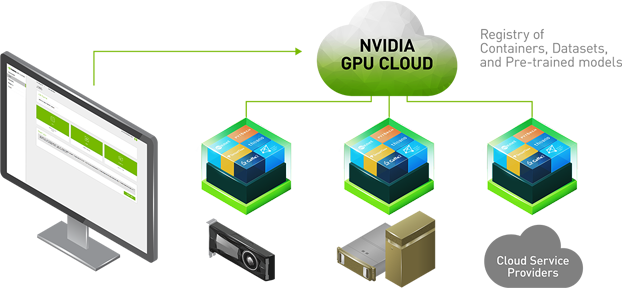
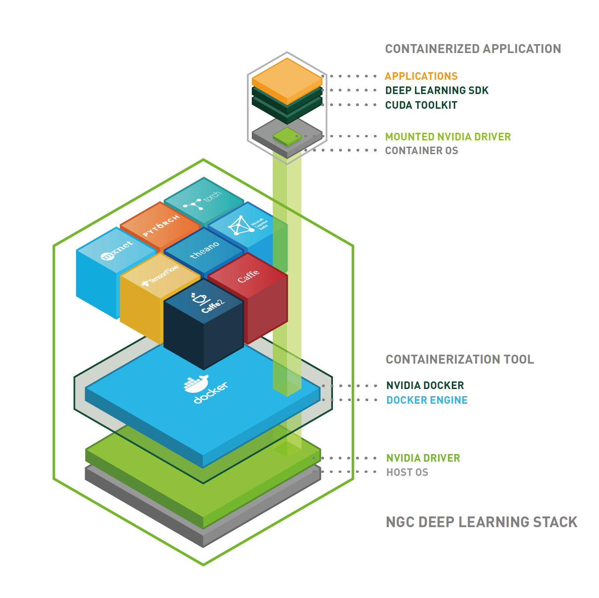

Docker on NVIDIA GPU Cloud
************************************

After knowing about the basic knowledge of Docker platform and containers, we will use these in our computing. Fortunately, NVIDIA offers NVIDIA GPU Cloud (NGC), which empowers AI researchers with performance-engineered deep learning framework containers, allowing them to spend less time on IT, and more time experimenting, gaining insights, and driving results. 

About NVIDIA GPU Cloud(NGC)
==================================

NVIDIA GPU Cloud is a GPU-accelerated cloud platform optimized for deep learning. NGC manages a catalog of fully integrated and optimized deep learning framework containers that take full advantage of NVIDIA GPUs. These framework containers are delivered ready-to-run, including all necessary dependencies such as CUDA runtime, NVIDIA libraries, and an operating system. They are tuned, tested, and certified by NVIDIA to run on NVIDIA DGX Systems. NVIDIA updates these containers monthly to ensure they continue to provide peak performance.

NGC Container Registry
======================

The NGC container registry is a catalog of GPU-accelerated deep learning software. It includes CUDA Toolkit, DIGITS workflow, and the following deep learning frameworks: NVCaffe, Caffe2, Microsoft Cognitive Toolkit (CNTK), MXNet, PyTorch, TensorFlow, Theano, and Torch.

The NGC container registry provides containerized versions of these frameworks. These frameworks, including all necessary dependencies, form the NGC Deep Learning Stack. For users who need more flexibility to build custom deep learning solutions, each framework container image also includes the framework source code to enable custom modifications and enhancements, along with the complete software development stack.

The design of the platform software is centered around a minimal OS and driver install on the server and provisioning of all application and SDK software in NVIDIA Docker containers through NVIDIA Docker Registry.

NVIDIA Docker
======================

To enable portability in Docker images that leverage GPUs, NVIDIA
developed NVIDIA Docker, an open source project that provides a
command line tool to mount the user mode components of the NVIDIA
driver and the GPUs into the Docker container at launch. nv-docker is
essentially a wrapper around Docker that transparently provisions a
container with the necessary components to execute code on the GPU.

Use NGC Service on DGX Station
===============================

To use NGC Service and pull framework container images on DGX station, you can follow the steps below:

Before trying to get the images, you can first check if the container images are already on DGX station by::

 docker images

It will return the Docker images on your system::

 REPOSITORY                  TAG                            IMAGE ID            CREATED             SIZE
 nvcr.io/nvidia/theano       18.01                          dc2fda091dd4        5 weeks ago         4GB
 nvcr.io/nvidia/mxnet        18.01-py3                      1a70c143e041        5 weeks ago         2.67GB
 nvcr.io/nvidia/mxnet        18.01-py2                      ffe7de2f34c3        5 weeks ago         2.64GB
 nvcr.io/nvidia/pytorch      17.12                          5ac6ff8f9a81        2 months ago        4.52GB
 nvcr.io/nvidia/tensorflow   17.12                          19afd620fc8e        2 months ago        2.88GB
 nvcr.io/nvidia/caffe2       17.12                          ac17621b6d70        2 months ago        2.8GB
 nvcr.io/nvidia/caffe        17.12                          cd94fcaaec3f        2 months ago        3.25GB
 nvcr.io/nvidia/cuda         9.0-cudnn7-devel-ubuntu16.04   634be617d3ed        2 months ago        1.75GB
 
If there are no images you need or the images are out of date, you can continue the following steps.

1. Activate your NVIDIA DGX Cloud Services account.

2. Log on to the `DGX Cloud Services <http://compute.nvidia.com/>`_ website. `Obtain your API Key <http://docs.nvidia.com/dgx/dgx-registry-user-guide/index.html#getting-api-key>`_ so you can access the NVIDIA DGX Container Registry. 

3. Log in to the NVIDIA DGX Container Registry from a command line::

      sudo docker login nvcr.io

  When prompted for your username and password, enter the following text and the API key you already got::

     Username: $oauthtoken
     Password: **************************

4. Issue Docker commands such as pushing, pulling, or running Docker containers, depending on your user role.

   Download the container that you want from the registry::
       
       docker pull registry/registry-space/repository:tag

   You can click on the image in Registry you need and scroll down the web page to find the specific pull command of it. For example::

        docker pull nvcr.io/nvidia/tensorflow:18.01-py2

   Run a container::
      
      nvidia-docker run -it --rm –v local_dir:container_dir nvcr.io/nvidia/repository:<xx.xx>

   Detailed explanation of this command can be found `here <http://docs.nvidia.com/ngc/ngc-user-guide/index.html#keyconcepts>`_.
  
   More docker commands for NVIDIA DGX Cloud Service using can be found at `1 <http://docs.nvidia.com/dgx/dgx-registry-user-guide/index.html#using-dgx-registry-from-docker-command-line>`_ and `2 <http://docs.nvidia.com/ngc/ngc-user-guide/index.html>`_.
   
   The `following part <http://dgx-wiki.readthedocs.io/en/latest/docs/docker/command.html>`_ will introduce the common used docker commands.

