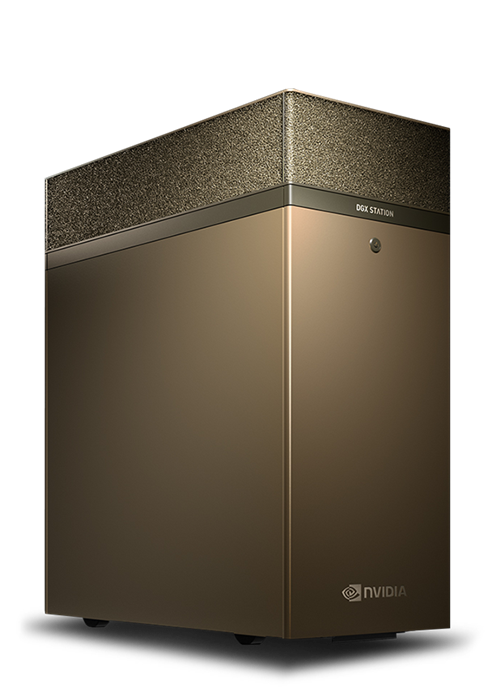
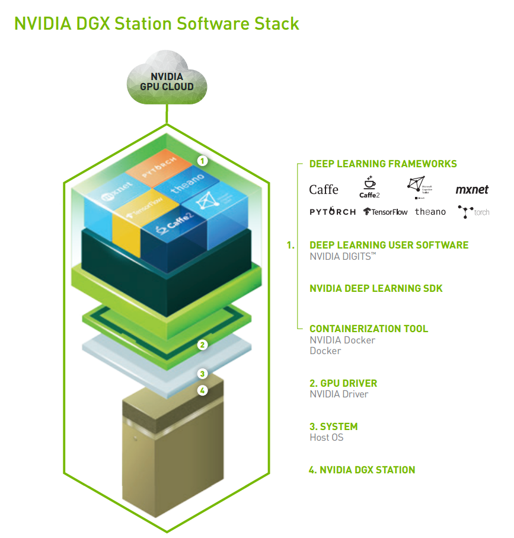
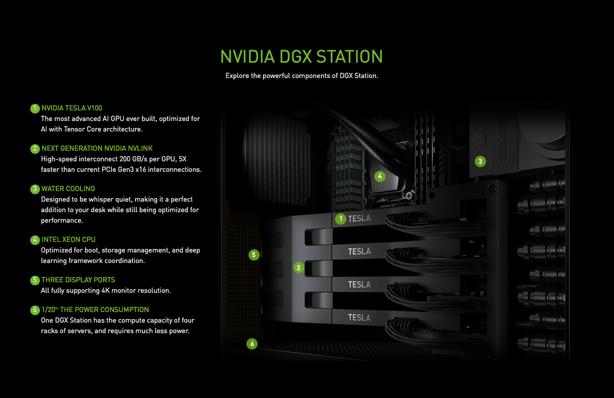

About DGX station
**************************

What is DGX Station
=====================

NVIDIA® DGX Station™ is the world’s first personal supercomputer for leading-edge AI development.

Features of DGX Station
========================

Deep learning platforms require software engineering expertise to keep today’s frameworks optimized for maximum performance, with time spent waiting on stable versions of open source software. This means hundreds of thousands of dollars in lost productivity, dwarfing the initial hardware cost. 

NVIDIA DGX Station includes the same software stack found in all DGX solutions. This innovative, integrated system includes access to popular deep learning frameworks, updated monthly, each optimized by NVIDIA engineers for maximized performance. It also includes access to NVIDIA DIGITS™ deep learning training application, third-party accelerated solutions, the the NVIDIA Deep Learning SDK (e.g. cuDNN, cuBLAS, NCCL), CUDA® Toolkit, and NVIDIA drivers.

Built on container technology powered by NVIDIA Docker, this unified deep learning software stack simplifies workflow, saving you days in re-compilation time when you need to scale your work and deploy your models in the data center or cloud.

Hardware Summary
==================

Processors

=========== === ==================================================================
Component   Qty Description
CPU         1   Intel Xeon E5-2698 v4 2.2 GHz (20-Core)
GPU         4   NVIDIA Tesla® V100 with 16 GB per GPU (64 GB total) of GPU memory
=========== === ==================================================================

System Memory and Storage

============= ==== =============  ================ ================================================
Component     Qty  Unit Capacity  Total Capacity   Description
System memory 8    32 GB          256 GB           ECC Registered LRDIMM DDR4 SDRAM
Data storage  3    1.92 TB        5.76 TB          2.5" 6 Gb/s SATA III SSD in RAID 0 configuration
OS storage    1    1.92 TB        1.92 TB          2.5" 6 Gb/s SATA III SSD
============= ==== =============  ================ ================================================

Read more at: http://docs.nvidia.com/dgx/dgx-station-user-guide/index.html