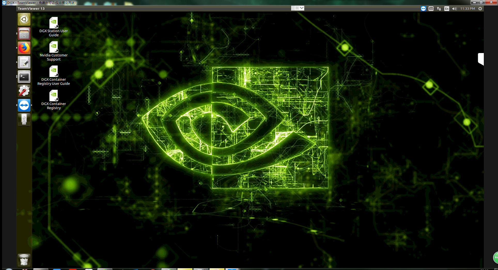

Connect to DGX station
*************************

Use ssh
========

Currently, DGX station can only be accessed via lab computers. You can follow the steps below to access it:

1. ssh eniac from anywhere using your `eniac account <http://www.geography.hunter.cuny.edu/tbw/CS.Linux.Lab.FAQ/department_of_computer_science.faq.htm>`_::

      ssh yourname@eniac.cs.hunter.cuny.edu

   (Note: Eniac account should be claimed by logging in from one of the Computer Science Linux Labs (1001B or 1001C), or it will be deleted)
2. ssh lab computers(mars or venus) from eniac.
3. ssh DGX station(IP: 146.95.214.135) from lab computers::
   
    ssh 146.95.214.135

Use Software
===============

To remotely control and have a graphic display of DGX station, two software are tested and work well on DGX station: `TeamViewer <https://www.teamviewer.us/>`_ and `NoMachine <https://www.nomachine.com/>`_. They should have been installed on DGX station. Detailed information about using them can be found on their official websites.

